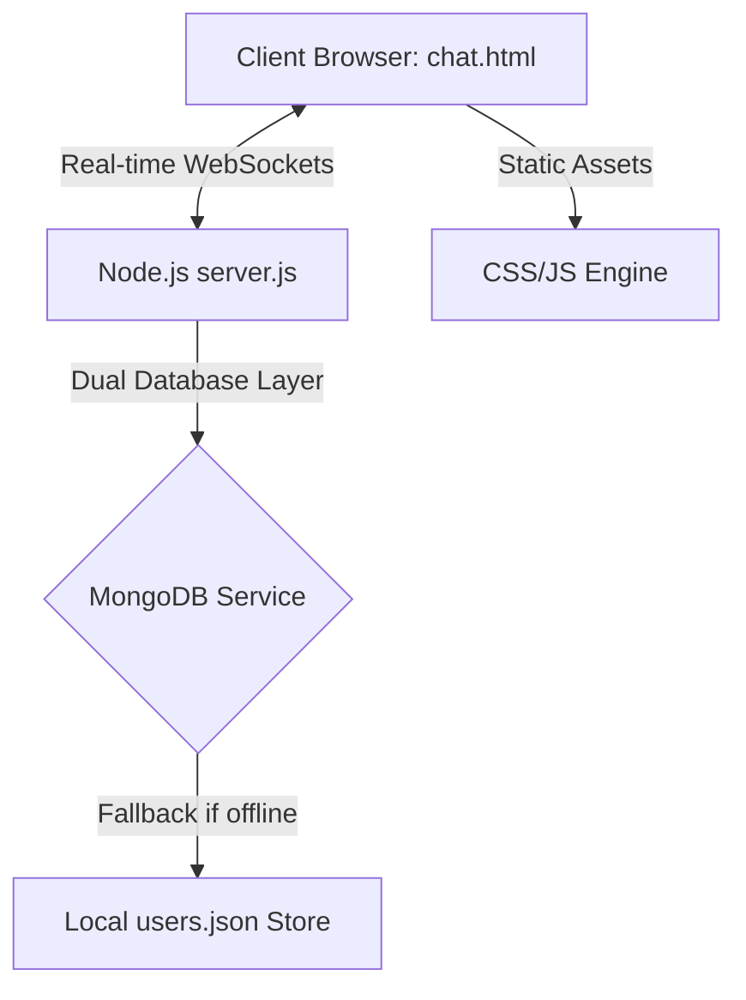

# WHISPERNET: COVERT END-TO-END ENCRYPTED CHAT & LSB STEGANOGRAPHY PROTOCOL
## COMPLETE SYSTEM ARCHITECTURE & TECHNICAL SPECIFICATION REPORT

---

## 1. PROJECT TITLE & GENERAL INTRODUCTION
*   **Project Name:** **WhisperNet**
*   **Aesthetic Theme:** High-contrast retro-cyberpunk / Glassmorphism
*   **Primary Objective:** Facilitate end-to-end encrypted real-time chat sessions coupled with cryptographic **Least Significant Bit (LSB) Audio Steganography** to embed secret messages invisibly inside digital audio carriers (microphone recordings and uploaded sound files).

### 1.1 The Steganography Problem Statement
Traditional encryption protocols (like SSL/TLS or standard AES) hide the *content* of a message, but not the *fact that a message is being sent*. An eavesdropper monitoring network metadata can detect active encryption and flag the users as suspicious. 
**WhisperNet** solves this problem by hiding the encrypted payloads inside standard digital audio waveforms. To a network auditor or metadata sniffer, the traffic appears to be a standard voice memo or audio clip exchange, masking the transmission of confidential information.

---

## 2. SYSTEM ARCHITECTURE & MAIN FILES

The application is engineered as a lightweight, high-performance, single-instance full-stack Node.js system:



### 2.1 Server Core (`server.js`)
*   **Runtime:** Node.js using Express.
*   **Database Integration:** Dual-mode persistence layer. Connects to MongoDB automatically if active. If local MongoDB is offline, it gracefully falls back to an uncompressed, structured JSON file database (`users.json`).
*   **WebSockets:** Socket.io managing persistent full-duplex socket pipes for real-time dynamic communications.
*   **AI Proxy Route:** Proxy endpoint (`/api/ai`) linking prompts to the Gemini API (if `GEMINI_API_KEY` is present in the environment) or routing them locally to an offline NLP regular-expression Q&A matching brain.

### 2.2 Client User Interface (`public/`)
*   **Structural Markup (`login.html`, `chat.html`):** Renders clean semantic HTML5 layouts containing activity log terminals, online rosters, audio composers, self-destruct timers, spectrum canvases, and slide-out AI drawers.
*   **Visual Layout Styles (`style.css`, `chat2.css`):** Vanilla CSS system implementing custom-tailored theme tokens, neon gradients, glassmorphism boundaries, and animated background grids.
*   **Operations JavaScript (`auth.js`, `script.js`):** Asynchronous authentication pipes, Web Audio API setups, LSB encoder/decoder mathematics, canvas visualizers, and socket event listeners.

---

## 3. SOCKET.IO EVENT ROSTER (COMMUNICATION CHANNELS)

The full-duplex WebSocket pipe leverages specific events to coordinate the real-time chat terminal:

| Event Name | Direction | Payload Structure | Description |
| :--- | :--- | :--- | :--- |
| `register-agent` | Client ➔ Server | `{ username: String }` | Registers the user's socket connection to their authenticated identity. |
| `user-count` | Server ➔ Client | `Number` | Broadcasts the current number of unique, active online agents. |
| `agent-roster` | Server ➔ Client | `Array<String>` | Broadcasts the updated list of active username tags online. |
| `typing` | Client ➔ Server ➔ Client | `{ username: String, isTyping: Boolean }` | Relays active typing state to produce visual indicators in the bubble feed. |
| `incoming-packet` | Client ➔ Server ➔ Client | `{ sender, text, audioData, audioMime, hidden_payload, aes_key }` | Broadcasts active message packets (text + audio + metadata) to all agents. |
| `noise-packet` | Client ➔ Server ➔ Client | `{ data: String, ts: Number }` | Sends high-frequency decoy dummy traffic packets to distort network patterns. |
| `ping-check` | Client ➔ Server ➔ Client | `Timestamp` | Asynchronous latency check used to calculate network ping values in milliseconds. |
| `disconnect` | Client ➔ Server | *None* | Automatically removes the socket ID from the active roster list upon exit. |

---

## 4. DESIGN SYSTEM & COLOR SPECIFICATIONS

The visual aesthetic relies on curated HSL neon palettes overlaying deep obsidian surfaces:

| Variable Name | Hex Code | Visual Application | Style Context |
| :--- | :--- | :--- | :--- |
| `--bg-obsidian` | `#050505` | Canvas background | Foundation base of the application. |
| `--surface` | `#0b020c` | Card borders / Backgrounds | Core backdrop of glassmorphic containers. |
| `--electric-cyan` | `#00f2ff` | Primary highlight / Cyan neon | Local message bubbles, online statuses, log outputs. |
| `--vivid-magenta` | `#ff00ea` | Secondary highlight / Pink neon | Remote message bubbles, recording mic waves, active alerts. |
| `--accent-amber` | `#FFBF00` | Warning highlights / Decoy neon | File vault download tags, masking active counts, density warnings. |
| `--text-main` | `#E0E0E0` | Primary typography | Sleek Montserrat body fonts. |
| `--dim` | `#555555` | Secondary typography | Labels, metadata, and background timestamps. |

---

## 5. LEAST SIGNIFICANT BIT (LSB) STEGANOGRAPHY PROTOCOL

Steganography operates by encoding bits directly into the binary samples of uncompressed PCM WAV audio channels.

### 5.1 The Mathematical Model
Audio waveforms are read as an array of floating-point values from `-1.0` to `1.0`. To encode the data safely without boundary overflows, WhisperNet clamps the float bounds to `[-0.9999, 0.9999]` and scales them symmetrically using `32768` to produce a signed `16-bit` integer representation:

$$intSample = \text{Math.round}(sample \times 32768)$$

We alter the **least significant bit** (bit 0) of the integer to carry our bit stream (`finalBits`):

*   **To encode a `'1'` bit:**
    $$intSample = intSample \mid 1$$
*   **To encode a `'0'` bit:**
    $$intSample = intSample \ \& \ \sim1$$

We then scale the integer back to a floating-point value to preserve the signal for the audio buffer:

$$sample = \frac{intSample}{32768}$$

Because the absolute variance introduced to any sample is at most $1/32768 \approx 0.00003$, the wave modification is entirely indistinguishable from noise and completely imperceptible to the human ear.

### 5.2 Packet Structure
A payload is embedded with a **32-bit length header** prepended to the data bit-stream.
```
[ 32-bit Integer Length Header ] + [ UTF-8 Encoded Bit String ]
```
During decoding, the first `32` samples are evaluated to parse the exact binary length of the stego message, preventing the reader from scanning past the payload boundary.

---

## 6. CYBER-SECURITY SAFEGUARDS & EXTRA FEATURES

### 6.1 Traffic Flood Masking (Decoy Decisive Protocol)
*   **The Hazard:** Passive network observers can analyze packet transmission times (traffic shapes) to identify when a human is active or typing.
*   **The Evasion:** Enabling **Traffic Masking** triggers a background process that fires random dummy payload packets (`noise-packet`) containing randomized alpha-numeric strings every `2` to `5` seconds. This flood creates continuous network static, making actual user messages mathematically invisible to traffic pattern analysis.

### 6.2 Self-Destruct Sequence (Countdown Auto-Purge)
*   **The Hazard:** If the physical laptop is captured or inspected after an active session, browser logs could compromise the conversation.
*   **The Evasion:** The countdown self-destruct mechanism allows users to arm a timer (`1` to `60` minutes). When the timer hits zero, a secure purge function fires, immediately scrubbing the chat feed, clearing the local File Vault, purging local database tables, and returning the dashboard to an uninitialized state.

### 6.3 Real-Time FFT Spectrum Analyzer
*   **Mechanism:** Operates on the Web Audio API using an `AnalyserNode` connected directly to the playing audio source.
*   **FFT Configuration:** Utilizes a Fast Fourier Transform size of `256` to extract `128` raw frequency bins. A `requestAnimationFrame` render loop queries heights via `getByteFrequencyData()` and renders the signal frequency spikes onto an HTML5 Canvas, providing visual confirmation of wave integrity.

---

## 7. SYSTEM RECOVERY & CONCLUSION

WhisperNet represents a secure full-stack steganography communication channel. 

### 7.1 Key Maintenance Notes
1.  **Bit Integrity Protection:** Modern audio formats (like MP3, WebM, or OGG) use lossy compression algorithms that strip high-frequency data, destroying LSB modifications. WhisperNet preserves LSB payloads by converting WebM/microphone captures into uncompressed, lossless **`audio/wav`** (PCM) blobs before transmission.
2.  **Deployment Independence:** All features are fully self-contained. Local code commits can be deployed seamlessly to production Vercel/Render platforms, operating independently of the local workstation status.
